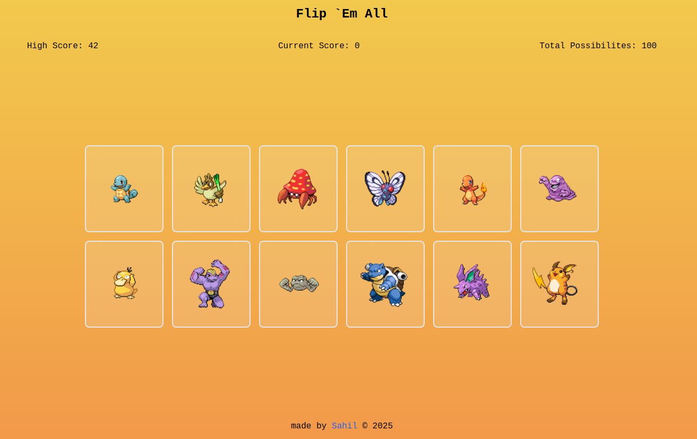

# FLIP `EM ALL

## About the Project

A small application made with implemention of concepts of using hooks to manage and usilize state while fetching and using data from an external API. I have tried to use TailwindCSS in this project.

## Result

[Click to see live](https://flip-em-all.netlify.app/)



## How to Play

- Only one rule, don't click the same card twice.

## Objectives

- [x] Should include a scoreboard which counts the current score, and a "Best Score"
- [x] There should be a function that displays the cards in a random order anytime a user clicks one. Be sure to invoke that function when the component mounts.
- [x] Use an external API to fecth images

## How to Install the Repo

### 1. Clone the Repository

- Fork the repository to your GitHub
- Clone the repository to your local machine by running the following command in your bash terminal

```bash
git clone git@github.com:yourUserName/memory-card-game.git

```

### 2. Navigate to the Project Directory

```bash
cd memory-card-game
```

### 3. Install Dependencies

Run the following command to install the required dependencies:

```bash
npm install
```

[Click here to view dependencies](./package.json)

## Running the Application

### 1. Start the Development Server

Use the following command to run the project locally:

```bash
npm run dev
```

### 2. Open your browser and navigate to:

```arduino
http://localhost:5173
```

Replace `5173` with port specified in the project (if different)

## Things I would like to add in future

- [ ] Different difficulty setting along with home page
- [ ] Music complementing the theme
- [x] Store highScore in localStorage

## Disclaimers

This project uses data provided by [PokéAPI](https://pokeapi.co/). PokéAPI is an open RESTful API for accessing Pokémon data.

This project is not affiliated with Nintendo, Game Freak, or The Pokémon Company. Pokémon and related content are trademarks of their respective owners.

The information displayed here is retrieved from [PokéAPI](https://pokeapi.co/). While we(me) strive to ensure accuracy, data may not always be up-to-date. This application relies on the availability of PokéAPI, and we do not guarantee uninterrupted access to data.

This project is created for educational and non-commercial purposes.
